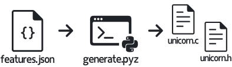

<picture>
  <source media="(prefers-color-scheme: dark)" srcset=".github/unicorn-dark.svg">
  <source media="(prefers-color-scheme: light)" srcset=".github/unicorn.svg">
  
</picture>

Unicorn is a lightweight, embeddable implementation of essential Unicode® algorithms written in C99.

Unicorn is compliant with the **MISRA C:2012** coding standard.
It's perfect for resource constrained devices like microcontrollers and IoT devices.

This repository contains the scripts to generate the Unicorn header/source amalgamation.
The unamalgamated source code is available exclusively to commercial licensees.

[](https://github.com/RailgunLabs/unicorn/actions/workflows/build.yml)


## Features

* Normalization ([docs](https://RailgunLabs.com/unicorn/manual/api/normalization/))
* Case mapping ([docs](https://RailgunLabs.com/unicorn/manual/api/case-mapping/))
* Collation ([docs](https://RailgunLabs.com/unicorn/manual/api/collation/))
* Segmentation ([docs](https://RailgunLabs.com/unicorn/manual/api/segmentation/))
* Short string compression ([docs](https://RailgunLabs.com/unicorn/manual/api/compression/))
* UTF-8, 16, and 32 iterators and convertors ([docs](https://RailgunLabs.com/unicorn/manual/api/text-encodings/))
* Various character properties ([docs](https://RailgunLabs.com/unicorn/manual/api/character-properties/))
* MISRA C:2012 compliance ([learn more](https://RailgunLabs.com/unicorn/manual/misra-compliance/))
* Distributed as a single header/source amalgamation
* Written in C99 with no external dependencies

## Fully Customizable

Unicorn is fully customizable.
You can choose which Unicode algorithms and character properties to include.

To customize Unicorn, modify `features.json` and run the `generate.pyz` script.
This script will generate the `unicorn.c` and `unicorn.h` source files which you can compile with your C project.
When Unicorn is built with a provided build system (e.g. CMake), the script is executed automatically as part of the build process.

<p align="center">
  <picture>
    <source media="(prefers-color-scheme: dark)" srcset=".github/customization-dark.svg">
    <source media="(prefers-color-scheme: light)" srcset=".github/customization.svg">
    
  </picture>
</p>

The schema for `features.json` is [documented here](https://RailgunLabs.com/unicorn/manual/feature-customization/).

## Ultra Portable

Unicorn is _ultra portable_.
It does **not** require an FPU or 64-bit integers.
It's written in C99 and only requires a few features from libc which are listed in the following table.

| Header | Types | Macros | Functions |
| --- | --- | --- | --- |
| **stdint.h** |  `int8_t`, `int16_t`, `int32_t` <br/> `uint8_t`, `uint16_t`, `uint32_t` | | |
| **string.h** | | | `memcpy`, `memset`, `memcmp` |
| **stddef.h** | `size_t` | `NULL` | |
| **stdbool.h** | |  `bool`, `true`, `false` | |
| **assert.h** | |  `assert` | |

## MISRA C:2012 Compliance

Unicorn honors all Mandatory, most Required, and most Advisory rules defined by MISRA C:2012 and its amendments.
Deviations are [documented here](https://RailgunLabs.com/unicorn/manual/misra-compliance/).
You are encouraged to audit Unicorn and verify its level of conformance is acceptable.

## Supported Unicode Encodings

All functions that operate on text can accept UTF-8, UTF-16, UTF-32, or Unicode scalar values.
UTF-16 and UTF-32 are accepted as big endian, little endian, and native byte order.

By default, the implementation performs runtime safety checks to guard against malformed or maliciously encoded text.
If you _know_ your text isn't malformed you can opt-in to skip these checks to improve processing performance.

## Thread Safety

Unicorn **is** thread-safe except for the following caveats:

* Functions that allocate memory are only as thread-safe as the allocator itself.
* The [configuration API](https://RailgunLabs.com/unicorn/manual/api/library-configuration/) is **not** thread-safe, however, in typical usage it's only invoked at application startup and only if the default configuration is unsatisfactory.

## Atomic Operations

All operations in Unicorn are _atomic_.
That means either an operation occurs or nothing occurs at all.
This guarantees errors, such as out-of-memory errors, never corrupt internal state.
This also means if an error occurs, like an out of memory error, then you can recover (free up memory) and try the same operation again.

## Extensively Tested

* 100% branch test coverage
* Official Unicode conformance tests
* Manually written tests
* Out-of-memory tests
* Fuzz tests
* Static analysis
* Valgrind analysis
* Code sanitizers (UBSAN, ASAN, and MSAN)
* Extensive use of assert() and run-time checks

## Installation

Download a prebuilt header/source amalgamation from the [releases page](https://github.com/RailgunLabs/unicorn/releases) or generate one yourself by running `./generate.pyz` (requires Python 3.10 or newer).
The prebuilt amalgamation includes _all_ features whereas the one you generate yourself only includes the features you specify in [features.json](features.json).

Alternatively, build a linkable library with

```
$ ./configure
$ make
$ make install
```

or [CMake](https://cmake.org/).

## Support

* [Documentation](https://RailgunLabs.com/unicorn/manual/)
* [Premium Support](https://RailgunLabs.com/services)

Submit patches and bug reports to [RailgunLabs.com/contribute](https://RailgunLabs.com/contribute).
Do **not** open a pull request.
The pull request tab is enabled because GitHub does not provide a mechanism to disable it.

## License

Unicorn is free of charge for non-commercial use.
You can purchase a commercial license from [Railgun Labs](https://RailgunLabs.com/unicorn/license/).

The unamalgamated C source code, the programs for generating the Unicode data, and the unit tests are **not** open source.
Access to them is granted exclusively to commercial licensees.

_Unicode® is a registered trademark of Unicode, Inc. in the United States and other countries.
This project is not in any way associated with or endorsed or sponsored by Unicode, Inc. (aka The Unicode Consortium)._
